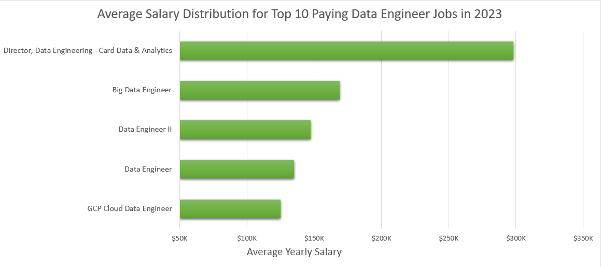
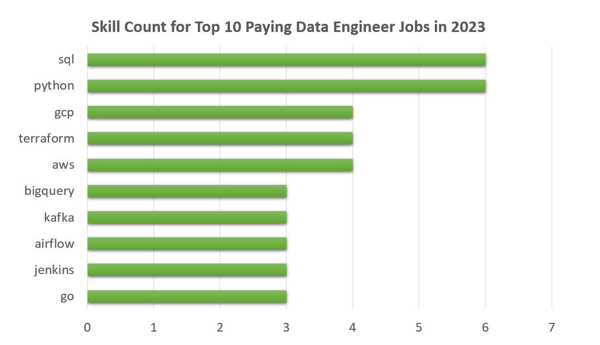

# Introduction
## 💼 Dive into the Data Job Market: Focus on Data Engineer Roles

This project explores the **Data Engineer job market in Michigan, USA**, with a broader look at the general labor market.  
It uses SQL to uncover key insights:

- 🔝 **Top-paying jobs** for Data Engineers  
- 🛠️ **Most in-demand skills** and how they correlate with salary  
- 🧠 **Optimal skills to learn**, where high demand meets high compensation

The analysis is based on real job posting data and focuses on practical takeaways for career growth in data engineering.

> 📁 All SQL queries and findings are located in the [`project_1_sql`](./project_1_sql/) folder.
### 📌 Table of Contents
- [📚 Background](#-background)
- [❓ Key Questions Answered with SQL](#-key-questions-answered-with-sql)
- [🛠️ Tools I Used](#-tools-i-used)
- [📊 The Analysis](#-the-analysis)
  - [🔝 Top-Paying Data Engineer Jobs](#-top-paying-data-engineer-jobs)
  - [🧠 Skills Required for Top-Paying Jobs](#-skills-required-for-top-paying-data-engineer-jobs)
  - [🔍 Most In-Demand Skills](#-what-skills-are-most-in-demand)
  - [💰 Skills Associated with Higher Salaries](#-which-skills-are-associated-with-higher-salaries)
  - [📈 Correlation Between Salary and Demand](#-correlation-between-average-salary-and-job-demand)
- [📚 What I Learned](#-what-i-learned)
- [🔚 Conclusion](#-conclusion)
- [📌 Closing Thoughts](#-closing-thoughts)
- [📦 Data Source](#-data-source)
## 📚 Background

Driven by a desire to better navigate the **Data Engineer** job market, this project aims to:

- Pinpoint the **top-paid** and **most in-demand** skills  
- Streamline the job-hunting process  
- Help others focus their efforts on learning **optimal tools** for career growth

---

### ❓ Key Questions Answered with SQL:

1. 💰 What are the **top-paying** Data Engineer jobs?  
2. 🛠️ What **skills** are required for these top-paying jobs?  
3. 📊 What skills are **most in demand** for Data Engineers?  
4. 📈 Which skills are associated with **higher salaries**?  
5. 🧠 What are the most **optimal skills to learn**?

### 🛠️ Tools I Used

- **SQL** – To extract insights and analyze job market trends  
- **PostgreSQL** – For managing and querying the job data  
- **Visual Studio Code** – As my primary development environment  
- **Git & GitHub** – For version control and collaboration  
- **Excel** – For visualizing key results and trends

## 📊 The Analysis

Each query in this project was designed to explore a specific aspect of the **Data Engineer** job market.  
Here's how I approached each question:

### 1. 🔝 Top-Paying Data Engineer Jobs  
To identify the highest-paying roles, I filtered **Data Engineer** positions by average yearly salary, focusing on jobs located in **Michigan, USA**.  
This query highlights the best-paying opportunities in the field and helps reveal which companies offer it.
``` sql
SELECT
    job_id,
    job_title,
    company_dim.name,
    job_schedule_type,
    job_location,
    salary_year_avg,
    job_posted_date
FROM job_postings_fact
LEFT JOIN company_dim ON company_dim.company_id=job_postings_fact.company_id
WHERE job_location LIKE '%MI'
    AND salary_year_avg IS NOT NULL
    AND job_title_short = 'Data Engineer'
ORDER BY salary_year_avg DESC
LIMIT 10;
```


 Breaking It Down

-  **Good Salary Range:**
The top 10 highest-paying Data Engineer roles offer salaries ranging from **$125,000** to **$308,000**, highlighting the strong earning potential in this career path.

-  **Employers from Various Industries:**
These roles come from a diverse mix of industries — including IT companies like **HTC Global Services** and **Stefanini**, HR and consulting firms such as **Rapid Global Business Solutions** and **NDX Human Capital Solutions**, and even the automotive giant **Ford Motor Company**.

-  **Variety in Job Titles:** 
There's a wide range of job titles, from **Data Engineer** to **Director of Data Engineering**, reflecting the career progression and specialization within the field.


*Bar graph visualizing the average salary for the top 10 job postings for data engineers; I created this chart in Excel based on my SQL query results.*

### 2. 🧠 Skills Required for Top-Paying Data Engineer Jobs  
After identifying the top 10 highest-paying **Data Engineer** jobs in **Michigan, USA**, I enriched the analysis by joining the job listings with their associated skills.  
This query helps uncover which technical skills are most commonly required for these top-paying positions — offering valuable guidance on what to learn to land similar roles.
```sql
WITH top_10_jobs AS(
SELECT
    job_id,
    job_title,
    company_dim.name AS company_name,
    job_schedule_type,
    job_location,
    salary_year_avg,
    job_posted_date
FROM job_postings_fact
LEFT JOIN company_dim ON company_dim.company_id=job_postings_fact.company_id
WHERE job_location LIKE '%MI'
    AND salary_year_avg IS NOT NULL
    AND job_title_short = 'Data Engineer'
ORDER BY salary_year_avg DESC
LIMIT 10
)
SELECT 
    top_10_jobs.*,
    skills_dim.skills
FROM top_10_jobs
INNER JOIN skills_job_dim ON skills_job_dim.job_id = top_10_jobs.job_id
INNER JOIN skills_dim ON skills_dim.skill_id = skills_job_dim.skill_id;
```

 Here is a breakdown of the most commonly requested technical skills among the top 10 highest-paying Data Engineer jobs:

-  **SQL** and **Python** lead the list — each required in **6** of the top roles.
-  **GCP**, **Terraform**, and **AWS** follow closely — appearing in **4** listings each.
-  Other tools such as **BigQuery**, **Kafka**, **Airflow**, **Jenkins**, and **Go** appeared in fewer than 3 listings each.


*Bar graph visualizing the count of skills for the top 10 highest-paying Data Engineer jobs; I created this chart in Excel based on my SQL query results.*

### 3. 🔍 What Skills Are **Most in Demand**?

This query highlights the most **in-demand**  skills across all job listings in **2023**.  
It helps identify which competencies were most frequently requested by employers—guiding both hiring decisions and skill development strategies.
```sql
SELECT
    skills_dim.skills AS skill_name,
    COUNT(*) AS skill_count
FROM skills_job_dim
INNER JOIN job_postings_fact ON skills_job_dim.job_id = job_postings_fact.job_id
INNER JOIN skills_dim ON skills_dim.skill_id = skills_job_dim.skill_id
WHERE job_title_short = 'Data Engineer'
GROUP BY skill_name
ORDER BY skill_count DESC
LIMIT 5;
```
The results clearly show that **SQL** and **Python** dominate the top required skills, with a significant gap before **AWS**, which ranks third. **Azure** and **Spark** complete the list of the top five most in-demand technologies.

| Skill   | Demand Count   |
|---------|---------|
| SQL     | 113375  |
| Python  | 108265  |
| AWS     | 62174   |
| Azure   | 60823   |
| Spark   | 53789   |

### 4. 💰 Which Skills Are Associated with **Higher Salaries**?

This query reveals which skills are linked to the **highest average salaries** across all job listings in **2023**.  
It helps uncover which technical competencies tend to offer the greatest earning potential.

```sql
SELECT
    skills_dim.skills,
    AVG(salary_year_avg) AS salary
FROM job_postings_fact
INNER JOIN skills_job_dim ON skills_job_dim.job_id = job_postings_fact.job_id
INNER JOIN skills_dim ON skills_dim.skill_id = skills_job_dim.skill_id
WHERE salary_year_avg IS NOT NULL
    AND job_title_short = 'Data Engineer'
GROUP BY skills_dim.skills
ORDER BY salary DESC
LIMIT 5;
```

The results show that **Node**, **MongoDB**, and **ggplot2** stand out with higher average salaries, distancing themselves from **Solidity** and **Vue**, which follow with a noticeable gap.  

However, the question remains: are these skills truly the most optimal to learn for career growth?  

| Skill    | Average Salary (USD) |
|----------|------------------------|
| Node.js  | 181861              |
| MongoDB  | 179402              |
| ggplot2  | 176250              |
| Solidity | 166250             |
| Vue.js   | 159375              |


### 5. 📈 Correlation Between Average Salary and Job Demand

This section answers the previous question by showing how average salary correlates with the number of requests (job postings) across all listings, specifically focusing on Michigan, USA.  
It helps illustrate whether the highest-paying skills are also the most in-demand in this region.

🔄 Sorting by Demand
```sql
SELECT 
    COUNT(job_postings_fact.job_id) AS job_count,
    skills_dim.skills,
    AVG(salary_year_avg) AS avg_salary
FROM job_postings_fact
INNER JOIN skills_job_dim ON skills_job_dim.job_id = job_postings_fact.job_id
INNER JOIN skills_dim ON skills_dim.skill_id = skills_job_dim.skill_id
WHERE salary_year_avg IS NOT NULL
    AND job_title_short = 'Data Engineer'
    AND job_location LIKE '%MI'
GROUP BY skills_dim.skills
ORDER BY job_count DESC
LIMIT 10;
```
Here we can see that **SQL** and **Python** are leading in **demand**, appearing most frequently in job postings.  
However, **AWS** and **Airflow** top the chart in terms of **average salary**, with a significant gap between them and the rest

| Demand Count | Skills     | Average Salary (USD)    |           
|-----------|------------|----------------|
| 29        | sql        | 102781      |
| 26        | python     | 106641      |
| 13        | aws        | 136878      |
| 13        | hadoop     | 98667       |
| 11        | gcp        | 105886      |
| 10        | azure      | 103142      |
| 9         | sql server | 97222       |
| 8         | bigquery   | 115000      |
| 8         | java       | 108178      |
| 7         | airflow    | 119464      |

🔄 Sorting by Salary

By using:

```sql
ORDER BY avg_salary DESC
```
We observe that **Go** stands out by combining **high demand** with a **top average salary**, making it one of the most valuable skills overall.
Interestingly, **AWS**, which we previously saw leading in salary, appears only in 7th place — suggesting that while it's well-paid, it may not be as broadly in demand as other skills.

| job_count | skills   | avg_salary           |
|-----------|----------|----------------------|
| 5         | go       | 176800             |
| 1         | splunk   | 169000             |
| 1         | linux    | 169000             |
| 1         | spring   | 165000             |
| 2         | kubernetes | 158250             |
| 2         | docker   | 158250            |
| 3         | jenkins  | 145833  |
| 13        | aws      | 136878   |
| 3         | git      | 132498   |
| 4         | github   | 129123      |

## 📚 What I Learned

Through this project, I gained experience with:

- The **basics of SQL** for data extraction and analysis, including familiarity with CTEs, sorting, and filtering functions  
- Getting comfortable with the **Visual Studio Code** interface  
- Using **GitHub** for version control and sharing projects publicly  
- Some hands-on practice with **importing data and creating charts in Excel**   
### 🔚 Conclusion

### 🧠 Insights

1. 💰 **Strong Salary Range**  
   Top-paying roles offer between **$125K–$308K**, showing excellent earning potential.

2. 🏢 **Industry Variety**  
   Opportunities span IT, consulting, HR, and automotive sectors — including **Ford**, **HTC Global**, and others.

3. 📌 **Diverse Job Titles**  
   Roles range from **Data Engineer** to **Director of Data Engineering**, indicating room for career growth.

4. 🛠️ **Top Skills in High-Paying Jobs**  
   - **Most Requested:** `SQL`, `Python`  
   - **Also Common:** `AWS`, `GCP`, `Terraform`  
   - **Occasional Mentions:** `BigQuery`, `Kafka`, `Airflow`

5. 📈 **Demand vs. Salary Insights**  
   - `SQL` and `Python` dominate in demand  
   - `AWS` and `Airflow` correlate with higher salary  
   - `Go` is particularly valuable, balancing **demand** and **pay**


### 📌 Closing Thoughts

This project significantly advanced my knowledge in **SQL** and gave me valuable insights into the **Data Engineer job market**.  
It helped identify the most common and optimal skills to learn, and clarified what is needed to become a strong candidate in this field.

---


## 📦 Data Source

Data hails from the [SQL Course by Luke Barousse](https://lukebarousse.com/sql).  
It's packed with insights on job titles, salaries, locations, and essential skills.